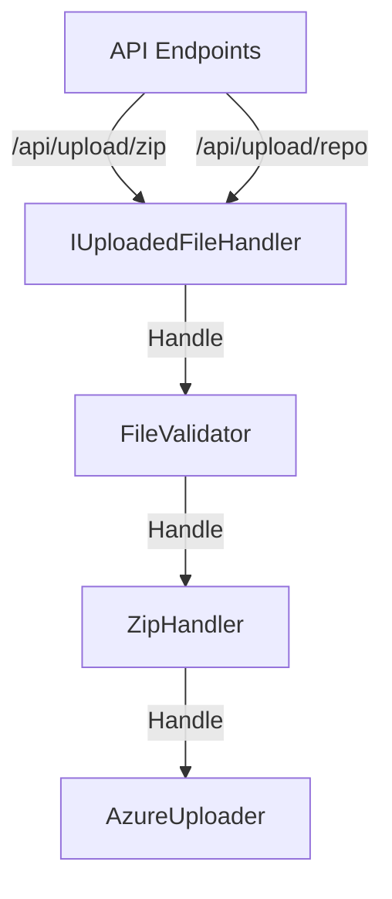

# Getting started

## Prerequisites

Setup launchsettings (default based on launchSettings.example.json should be fine).

Setup appsettings (use appsettings.example.json and fill in the blanks).
AzureBlobStorage isn't being used right now, but it's there for future use.
In the settings section, the path should be absolute.

## Running the application

If you want the webbook to work, you need to setup a tunneling service like Ngrok or localtunnel.
Setting up localtunnel is the easiest:

```bash
npm install -g localtunnel
```

```bash
lt --port 5000
```
